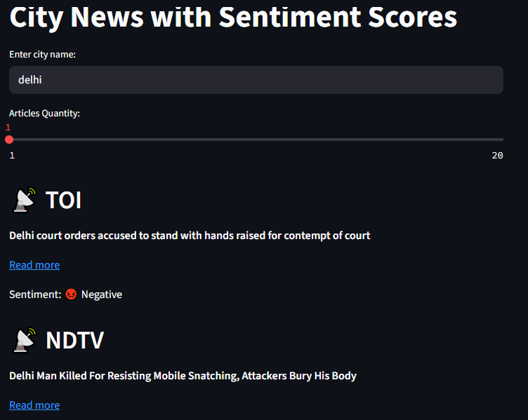

# News Sentiment Analyser
A webapp built on streamlit that webscrapes news from news sites like TOI, Hindustan Times, NDTV.   
Then the news is analysed using the VADER sentiment analyser as positive, negative or neutral  

## Libraries Used:
requests  
streamlit  
beautifulsoup4  
vaderSentiment

